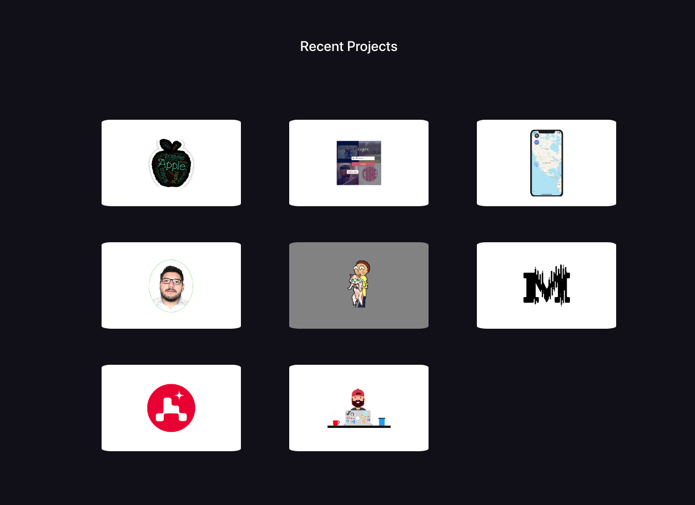

## Portfolio website

&nbsp;
&nbsp; 

## Portfolio website

demo here

## Table of contents
* [General info](#general-info)
* [Technologies](#technologies)
* [images](#images)

## General info

Portfolio v3 it is powered by React, HTML, CSS, and BootstrapUI mainly. I use CSS for customization and animations. I used Fontawesome for icons and some CSS to customize color and size. Also, the page is mobile responsive from pocket phones to tablets. Portfolio V3 is hosted by Firebase
	
## Technologies

Project is created with:
* React 
* HTML
* CSS
* BootstrapUI

## Images

##### Main 
 

##### Projects 
 
